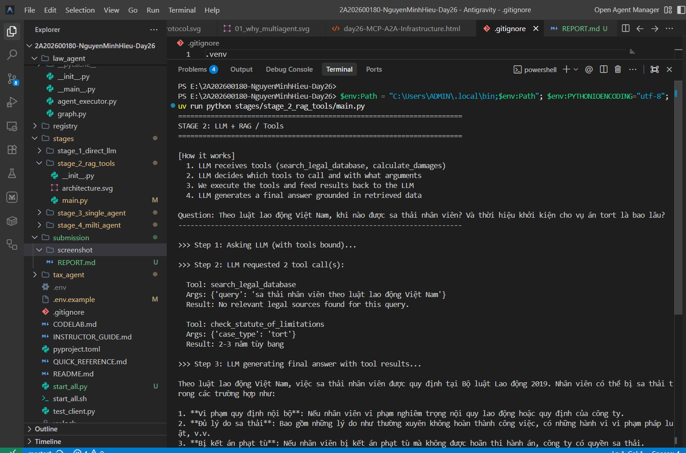
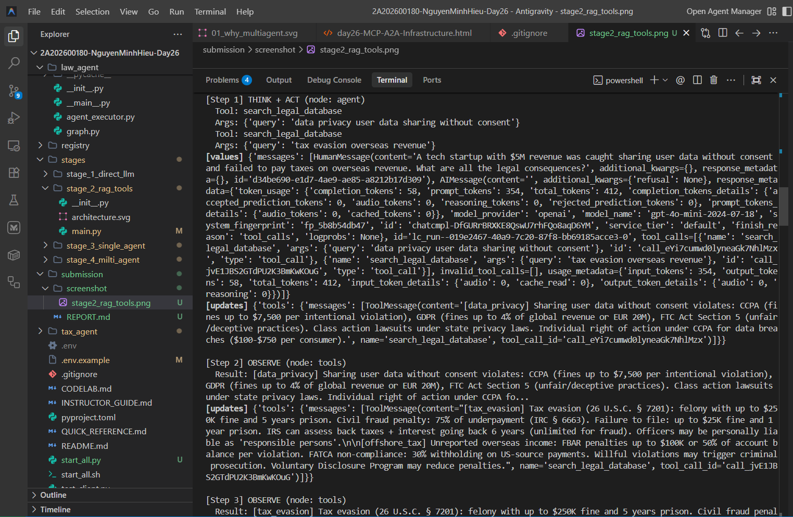
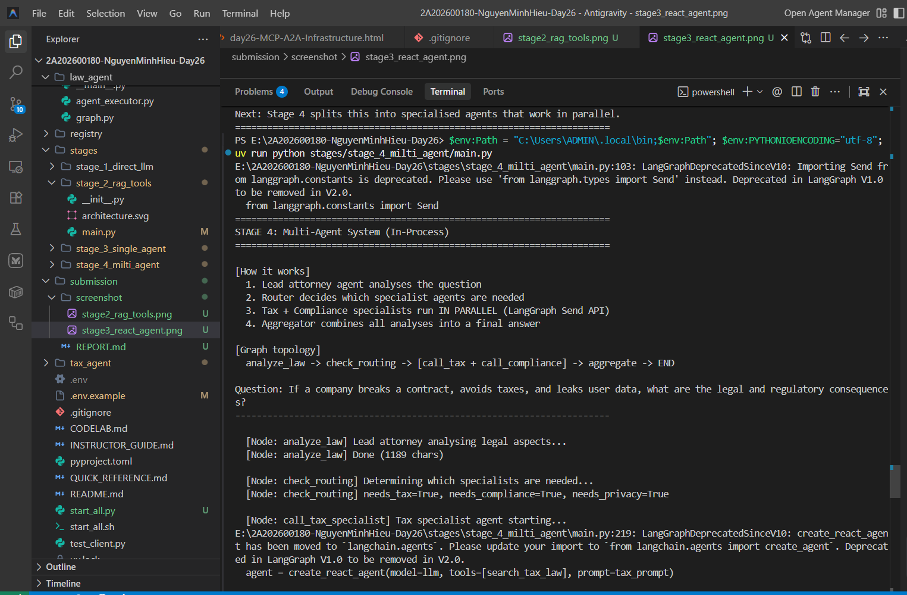
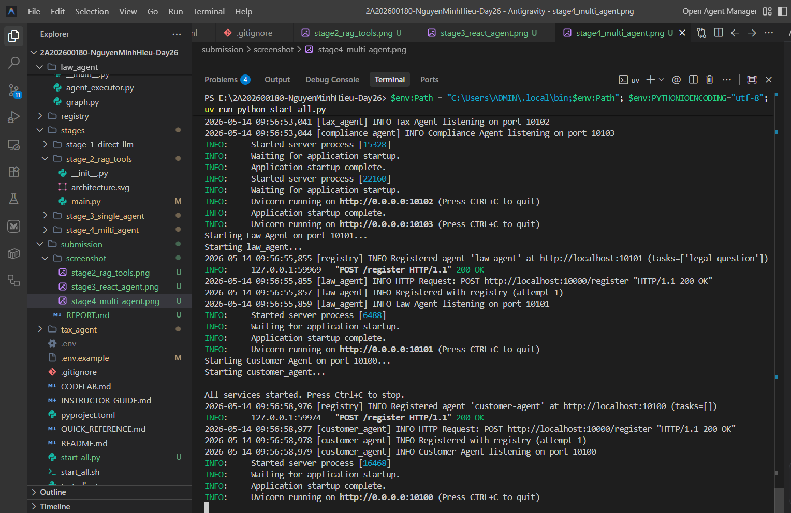
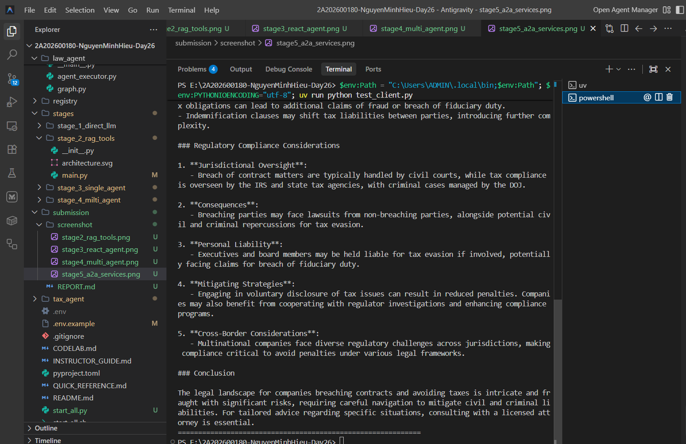
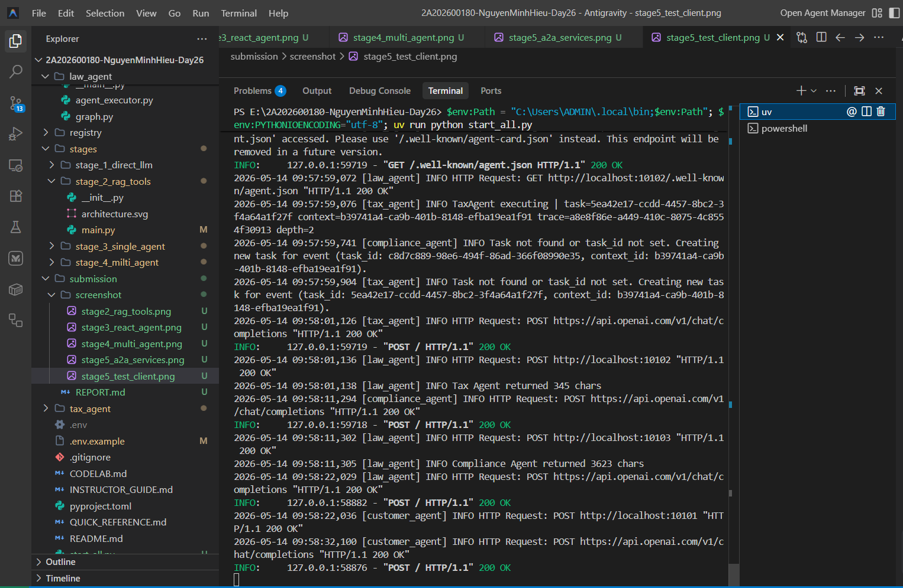

# Lab Report: Legal Multi-Agent System with A2A Protocol

**Student Name:** Nguyen Minh Hieu  
**Student ID:** 2A202600180  
**Date:** May 14, 2026  

---

## 1. Executive Summary
This lab demonstrates the evolution of Large Language Models (LLMs) from a simple stateless direct prompt to a fully distributed Agent-to-Agent (A2A) network. Throughout the 5 stages, several enhancements were implemented:
- **Retrieval-Augmented Generation (RAG) and Tools:** Expanded the knowledge base to include Vietnamese Labor Law and created custom tools for statute limitations calculation and case law searches.
- **ReAct Agent Logic:** Implemented an autonomous `Think -> Act -> Observe` loop allowing the agent to break down complex queries.
- **In-Process Multi-Agent System:** Structured specialized agents (Law, Tax, Compliance, and a newly implemented **Privacy Agent**) working in parallel using LangGraph.
- **Distributed A2A Protocol:** Transitioned the system into a microservices architecture where agents discover each other dynamically via a Registry service and communicate over HTTP.

## 2. Completed Exercises & Evidence

### Stage 2: RAG & Tools Implementation
- Added a new entry for "Vietnam Labor Law 2019" into the knowledge base.
- Created the `check_statute_of_limitations` tool.
*Evidence:*

### Stage 3: Single Agent with ReAct
- Implemented the `search_case_law` tool.
- Enabled debugging (`verbose=True` / `debug=True`) to trace the agent's internal reasoning.
*Evidence:*

### Stage 4: Multi-Agent In-Process
- Developed the `privacy_agent` to handle GDPR and data protection queries.
- Updated the LangGraph conditional routing logic to dispatch tasks to the `privacy_agent` in parallel with tax and compliance agents.
*Evidence:*

### Stage 5: Distributed A2A System
- Simulated a fault-tolerance scenario and modified the `Tax Agent` system prompt to restrict responses to a maximum of 2 sentences.
- Monitored `trace_id` propagation across the Registry, Customer, Law, Tax, and Compliance agents.
*Evidence:*
- Running A2A Services: 
- Test Client Output: 
- Distributed Trace Logs: 

---
*End of Report*
